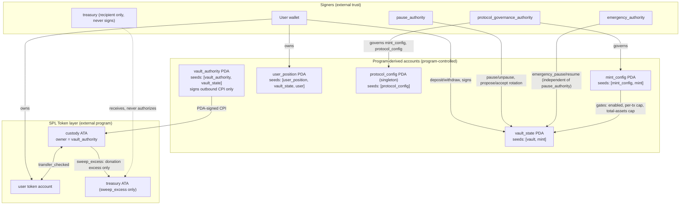
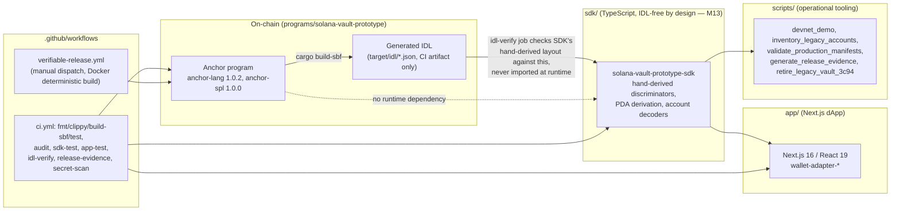

# Dependency and trust-boundary graph

This document is a visual supplement to `ARCHITECTURE.md` (the authoritative,
already-detailed source for account tables, PDA seeds, instruction contracts, CPI
flows, arithmetic formulas, invariants, and state transitions — read that first). It
adds two things `ARCHITECTURE.md` doesn't have: diagrams, and a view of the
off-chain/repo-level dependency graph (SDK, dApp, scripts, CI) that sits outside the
program's own scope.

## 1. On-chain trust boundaries

Full field-level detail (exact byte layouts, bump storage, versioning) is in
`ARCHITECTURE.md`'s PDA table (line ~92) and Account table (line ~104). The key
invariant this diagram makes visible: **three independent signer roles** exist
(`pause_authority`, `protocol_governance_authority`, `emergency_authority`), and none
of them can move user assets directly — every asset movement is either a user-signed
`deposit`/`withdraw` or the constrained `sweep_excess` (donation-only, treasury-only,
exact-excess-only, gated on `!Active`). This separation is what makes a single
compromised governance key non-catastrophic to custody, per ADR 0003/0006.

## 2. Off-chain / repository dependency graph

`ARCHITECTURE.md` is program-scoped; this is the wider picture Phase 2 of a
production-readiness audit expects — what depends on what across the whole repo.

The notable design choice here (already documented in `docs/decisions/`, restated for
graph completeness): the SDK has **no runtime dependency on the generated IDL** — it
ships hand-written discriminators and account decoders, verified against the real IDL
only inside CI's `idl-verify` job. That's a deliberate portability/maintainability
trade explained in M13/M19; it means the SDK can be published and consumed without
requiring consumers to generate or ship an IDL, at the cost of needing that CI check
to keep the hand-written layout honest.

## 3. Rust crate dependency surface (security-relevant, not exhaustive)

From `Cargo.lock` (`cargo audit`/`cargo-deny` cover the full graph; this lists only
the categories that matter for a trust review):

| Category | Crates | Why it matters |
|---|---|---|
| Anchor framework | `anchor-lang 1.0.2`, `anchor-spl 1.0.0` | account validation macros, CPI helpers — the program's core trust primitive |
| SPL token | via `anchor-spl` (`token`, `associated_token` features) | legacy SPL Token Program only; Token-2022 explicitly out of scope (`SECURITY_CHECKLIST.md`) |
| Serialization | `borsh 1.7.0` | on-chain account (de)serialization; a borsh bug would be a direct custody risk |
| Crypto | `curve25519-dalek 4.1.3` (transitive via Solana SDK) | PDA/signature verification path |
| Dev-only | `solana-account`, `solana-message`, `solana-signer`, `solana-keypair`, `solana-pubkey`, `solana-clock` (`solana-account` currently pinned to `3.x` after PR #66 fixed an `E0308` type mismatch against `litesvm`) | test harness (`litesvm`, in-process SVM — no local validator needed) |
| Accepted risk | `rand 0.7.3` (transitive via `libsecp256k1 0.6.0`, deep in the pinned Agave/Anchor toolchain) | documented in `SECURITY_CHECKLIST.md`'s dependency-security-follow-up section as accepted: unsound condition doesn't apply to this codebase, and forcing a bump would require patching against an untested toolchain version |

`cargo-deny.toml` (added PR #52) declares a policy — deny git dependencies, deny
yanked crates — but as noted in `docs/engineering/baseline.md`, no CI job currently
runs `cargo deny check`, so this policy is not enforced. See backlog `SUPPLY-002`.

## Gaps this diagram makes visible that prose alone didn't

1. **No single doc previously showed the three-signer-role separation as a picture** —
   useful for a reviewer (interview or audit) to see at a glance that governance,
   emergency, and pause authorities are distinct and none can unilaterally move funds.
2. **The SDK's IDL-verification dependency is a single point of drift risk**: if
   `idl-verify` were ever skipped or made non-blocking, the SDK's hand-written layout
   could silently diverge from the real program. Worth an explicit invariant test
   asserting the job is `needs: build-and-test` and required (it already is, per
   `ci.yml` line 187 — recorded here as verified, not assumed).
3. **`cargo-deny.toml` and `redacted/SECRET_SCAN_RESULTS.md`'s lexical-only secret
   scan are both policy/analysis artifacts with no enforcement wiring yet** — tracked
   in the backlog rather than silently treated as "done" because the file exists.
